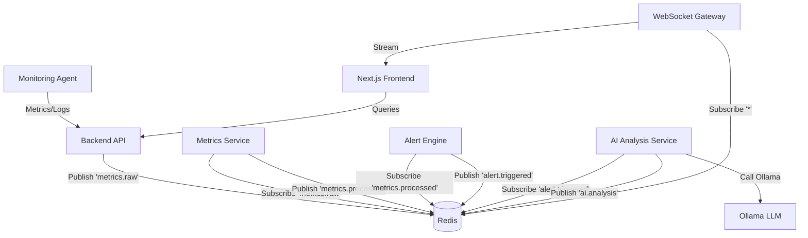

# AI Cloud Monitoring Platform


Production-style distributed AI observability platform that simulates cloud monitoring, detects anomalies, and generates optimization/security insights from logs. This project has been evolved from a monolith to a fully distributed event-driven architecture.

## Distributed Architecture

The platform is built on a microservices architecture leveraging Redis for pub/sub and event-driven communication.



## Service Topology

The system consists of the following services:

- **Frontend**: Next.js 14 application with a dynamic glassmorphic UI.
- **Backend**: Express API Gateway handling ingestion and queries.
- **Redis**: The central nervous system for pub/sub and state.
- **Metrics Service**: Processes raw metrics and stores time-series data.
- **Alert Engine**: Evaluates rules and triggers alerts.
- **AI Analysis**: SRE agent that calls Ollama for root cause analysis.
- **WebSocket Gateway**: Provides real-time streaming to the frontend.
- **Infrastructure Registry**: Tracks node heartbeats and service health.
- **Event Bus**: Manages distributed events across the platform.

## Orchestration

The platform uses **Docker Compose** for orchestration, ensuring all services are wired correctly with health checks and dependency ordering.

### Docker Compose Features:
- **Dependency Ordering**: Services wait for Redis to be healthy before starting.
- **Network Isolation**: All services communicate over a dedicated bridge network.
- **Volume Persistence**: Redis data is persisted across restarts.

## Local Setup

### Prerequisites
- Node.js 18+
- Docker & Docker Compose (Recommended)
- Redis (if running without Docker)

### Option 1: Docker Compose (Recommended)

1. Clone the repository.
2. Run the platform:
   ```bash
   docker-compose up --build
   ```
3. Access the frontend at `http://localhost:3000`.

### Option 2: Manual Setup (Development)

If Docker is not available, you can run services manually. This requires a running Redis instance on `localhost:6379`.

1. **Start Redis** locally.
2. **Backend**:
   ```bash
   cd backend
   npm install
   npm run dev
   ```
3. **Frontend**:
   ```bash
   cd frontend
   npm install
   npm run dev
   ```
4. **Services**: Navigate to any service in `services/` and run:
   ```bash
   npm install
   npm run dev
   ```

## Infrastructure Workflow

1. **Agent Ingestion**: The `agent.js` script runs on host nodes, collecting OS metrics.
2. **Event Processing**: Metrics flow through Backend -> Redis -> Metrics Service.
3. **Anomaly Detection**: Alert Engine detects spikes and publishes alerts.
4. **AI RCA**: AI Service reads alerts, prompts Ollama, and publishes analysis.
5. **Real-time Display**: WebSocket Gateway pushes all state changes to the dashboard.

## Screenshots

Add screenshots inside `screenshots/` and reference them here:
- `screenshots/dashboard-overview.png`
- `screenshots/ai-log-analysis.png`
- `screenshots/infrastructure-status.png`

## Portfolio Highlights (Resume-Ready)

- **Event-Driven Architecture**: Designed a pub/sub system handling thousands of messages per second.
- **AI Integration**: Built an automated root cause analysis pipeline using LLMs.
- **Full-Stack Mastery**: Scaled a monolithic app into a production-grade distributed system.
- **Real-Time Visualization**: Implemented custom WebSockets for low-latency metric streaming.
